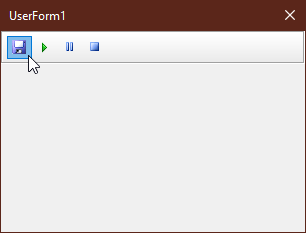

# XL_Toolbar  
## A Cool Looking Toolbar On A Userform in Excel  

 

Project started in january 2023.  
This example shows how to implement a toolbar on a userform in excel.  
We have a class Toolbar and a class ToolbarButton.
On the Userform we have a Frame-control on the frame control we have some Image-controls working as buttons.
The class ToolbarButton holds and manages the image-control and paints it due to the users mouse-actions.
The class Toolbar just holds and manages the different ToolbarButtons.
  
You maybe also want to have a look at the menubar repo: [XL_Menubar](https://github.com/OlimilO1402/XL_Menubar)  

